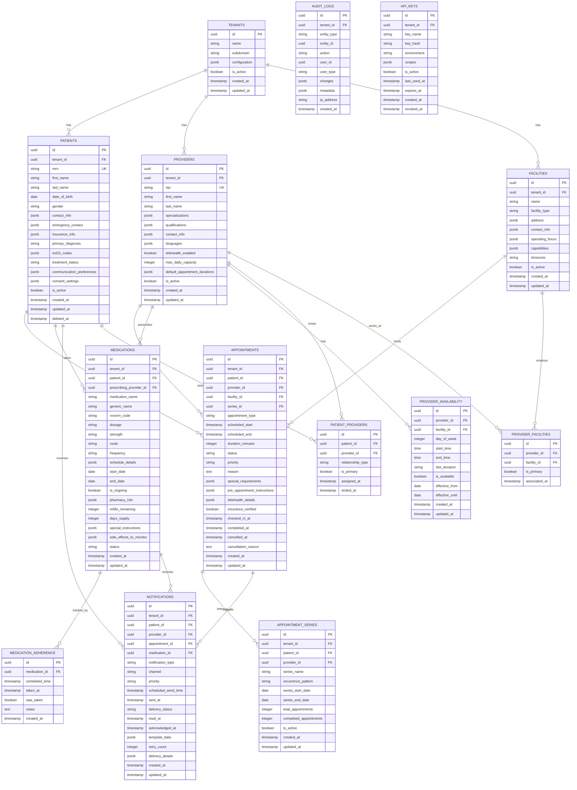

# Chronic Care API - Architecture Plan

## Table of Contents
1. [System Overview](#system-overview)
2. [Database Schema](#database-schema)
3. [Lambda Function Architecture](#lambda-function-architecture)
4. [Message Queue Architecture](#message-queue-architecture)
5. [Caching Strategy](#caching-strategy)
6. [API Gateway Configuration](#api-gateway-configuration)
7. [Integration Patterns](#integration-patterns)
8. [Deployment Architecture](#deployment-architecture)

## System Overview


## Database Schema

### ERD Diagram



### Table Definitions

#### Core Tables

**TENANTS**
```sql
CREATE TABLE tenants (
    id UUID PRIMARY KEY DEFAULT gen_random_uuid(),
    name VARCHAR(255) NOT NULL,
    subdomain VARCHAR(100) UNIQUE NOT NULL,
    configuration JSONB DEFAULT '{}',
    is_active BOOLEAN DEFAULT true,
    created_at TIMESTAMP DEFAULT CURRENT_TIMESTAMP,
    updated_at TIMESTAMP DEFAULT CURRENT_TIMESTAMP
);

CREATE INDEX idx_tenants_subdomain ON tenants(subdomain);
CREATE INDEX idx_tenants_active ON tenants(is_active);
```

**PATIENTS**
```sql
CREATE TABLE patients (
    id UUID PRIMARY KEY DEFAULT gen_random_uuid(),
    tenant_id UUID NOT NULL REFERENCES tenants(id),
    mrn VARCHAR(50) NOT NULL,
    first_name VARCHAR(100) NOT NULL,
    last_name VARCHAR(100) NOT NULL,
    date_of_birth DATE NOT NULL,
    gender VARCHAR(20),
    contact_info JSONB NOT NULL DEFAULT '{}',
    emergency_contact JSONB DEFAULT '{}',
    insurance_info JSONB DEFAULT '{}',
    primary_diagnosis VARCHAR(255),
    icd10_codes JSONB DEFAULT '[]',
    treatment_status VARCHAR(50) DEFAULT 'active',
    communication_preferences JSONB DEFAULT '{}',
    consent_settings JSONB DEFAULT '{}',
    is_active BOOLEAN DEFAULT true,
    created_at TIMESTAMP DEFAULT CURRENT_TIMESTAMP,
    updated_at TIMESTAMP DEFAULT CURRENT_TIMESTAMP,
    deleted_at TIMESTAMP,
    CONSTRAINT uk_patient_mrn_tenant UNIQUE(tenant_id, mrn)
);

CREATE INDEX idx_patients_tenant ON patients(tenant_id);
CREATE INDEX idx_patients_mrn ON patients(tenant_id, mrn);
CREATE INDEX idx_patients_name ON patients(last_name, first_name);
CREATE INDEX idx_patients_dob ON patients(date_of_birth);
CREATE INDEX idx_patients_active ON patients(is_active) WHERE deleted_at IS NULL;
```

**PROVIDERS**
```sql
CREATE TABLE providers (
    id UUID PRIMARY KEY DEFAULT gen_random_uuid(),
    tenant_id UUID NOT NULL REFERENCES tenants(id),
    npi VARCHAR(10) NOT NULL,
    first_name VARCHAR(100) NOT NULL,
    last_name VARCHAR(100) NOT NULL,
    specializations JSONB DEFAULT '[]',
    qualifications JSONB DEFAULT '[]',
    contact_info JSONB NOT NULL DEFAULT '{}',
    languages JSONB DEFAULT '["en"]',
    telehealth_enabled BOOLEAN DEFAULT false,
    max_daily_capacity INTEGER DEFAULT 20,
    default_appointment_durations JSONB DEFAULT '{}',
    is_active BOOLEAN DEFAULT true,
    created_at TIMESTAMP DEFAULT CURRENT_TIMESTAMP,
    updated_at TIMESTAMP DEFAULT CURRENT_TIMESTAMP,
    CONSTRAINT uk_provider_npi_tenant UNIQUE(tenant_id, npi)
);

CREATE INDEX idx_providers_tenant ON providers(tenant_id);
CREATE INDEX idx_providers_npi ON providers(npi);
CREATE INDEX idx_providers_specializations ON providers USING GIN(specializations);
CREATE INDEX idx_providers_active ON providers(is_active);
```

**FACILITIES**
```sql
CREATE TABLE facilities (
    id UUID PRIMARY KEY DEFAULT gen_random_uuid(),
    tenant_id UUID NOT NULL REFERENCES tenants(id),
    name VARCHAR(255) NOT NULL,
    facility_type VARCHAR(50) NOT NULL,
    address JSONB NOT NULL,
    contact_info JSONB DEFAULT '{}',
    operating_hours JSONB DEFAULT '{}',
    capabilities JSONB DEFAULT '[]',
    timezone VARCHAR(50) DEFAULT 'America/New_York',
    is_active BOOLEAN DEFAULT true,
    created_at TIMESTAMP DEFAULT CURRENT_TIMESTAMP,
    updated_at TIMESTAMP DEFAULT CURRENT_TIMESTAMP
);

CREATE INDEX idx_facilities_tenant ON facilities(tenant_id);
CREATE INDEX idx_facilities_type ON facilities(facility_type);
CREATE INDEX idx_facilities_active ON facilities(is_active);
```

**APPOINTMENTS**
```sql
CREATE TABLE appointments (
    id UUID PRIMARY KEY DEFAULT gen_random_uuid(),
    tenant_id UUID NOT NULL REFERENCES tenants(id),
    patient_id UUID NOT NULL REFERENCES patients(id),
    provider_id UUID NOT NULL REFERENCES providers(id),
    facility_id UUID NOT NULL REFERENCES facilities(id),
    series_id UUID REFERENCES appointment_series(id),
    appointment_type VARCHAR(50) NOT NULL,
    scheduled_start TIMESTAMP NOT NULL,
    scheduled_end TIMESTAMP NOT NULL,
    duration_minutes INTEGER NOT NULL,
    status VARCHAR(50) DEFAULT 'scheduled',
    priority VARCHAR(20) DEFAULT 'normal',
    reason TEXT,
    special_requirements JSONB DEFAULT '{}',
    pre_appointment_instructions JSONB DEFAULT '{}',
    telehealth_details JSONB,
    insurance_verified BOOLEAN DEFAULT false,
    checked_in_at TIMESTAMP,
    completed_at TIMESTAMP,
    cancelled_at TIMESTAMP,
    cancellation_reason TEXT,
    created_at TIMESTAMP DEFAULT CURRENT_TIMESTAMP,
    updated_at TIMESTAMP DEFAULT CURRENT_TIMESTAMP,
    CONSTRAINT chk_appointment_times CHECK (scheduled_end > scheduled_start)
);

CREATE INDEX idx_appointments_tenant ON appointments(tenant_id);
CREATE INDEX idx_appointments_patient ON appointments(patient_id);
CREATE INDEX idx_appointments_provider ON appointments(provider_id);
CREATE INDEX idx_appointments_facility ON appointments(facility_id);
CREATE INDEX idx_appointments_scheduled_start ON appointments(scheduled_start);
CREATE INDEX idx_appointments_status ON appointments(status);
CREATE INDEX idx_appointments_provider_date ON appointments(provider_id, scheduled_start);
CREATE INDEX idx_appointments_patient_date ON appointments(patient_id, scheduled_start);

-- Prevent double booking
CREATE UNIQUE INDEX idx_appointments_provider_time ON appointments(
    provider_id, scheduled_start
) WHERE status NOT IN ('cancelled', 'no-show');
```

**MEDICATIONS**
```sql
CREATE TABLE medications (
    id UUID PRIMARY KEY DEFAULT gen_random_uuid(),
    tenant_id UUID NOT NULL REFERENCES tenants(id),
    patient_id UUID NOT NULL REFERENCES patients(id),
    prescribing_provider_id UUID NOT NULL REFERENCES providers(id),
    medication_name VARCHAR(255) NOT NULL,
    generic_name VARCHAR(255),
    rxnorm_code VARCHAR(20),
    dosage VARCHAR(100) NOT NULL,
    strength VARCHAR(50),
    route VARCHAR(50) NOT NULL,
    frequency VARCHAR(100) NOT NULL,
    schedule_details JSONB DEFAULT '{}',
    start_date DATE NOT NULL,
    end_date DATE,
    is_ongoing BOOLEAN DEFAULT false,
    pharmacy_info JSONB DEFAULT '{}',
    refills_remaining INTEGER DEFAULT 0,
    days_supply INTEGER,
    special_instructions JSONB DEFAULT '{}',
    side_effects_to_monitor JSONB DEFAULT '[]',
    status VARCHAR(50) DEFAULT 'active',
    created_at TIMESTAMP DEFAULT CURRENT_TIMESTAMP,
    updated_at TIMESTAMP DEFAULT CURRENT_TIMESTAMP
);

CREATE INDEX idx_medications_tenant ON medications(tenant_id);
CREATE INDEX idx_medications_patient ON medications(patient_id);
CREATE INDEX idx_medications_provider ON medications(prescribing_provider_id);
CREATE INDEX idx_medications_status ON medications(status);
CREATE INDEX idx_medications_patient_active ON medications(patient_id, status) 
    WHERE status = 'active';
```

**NOTIFICATIONS**
```sql
CREATE TABLE notifications (
    id UUID PRIMARY KEY DEFAULT gen_random_uuid(),
    tenant_id UUID NOT NULL REFERENCES tenants(id),
    patient_id UUID REFERENCES patients(id),
    provider_id UUID REFERENCES providers(id),
    appointment_id UUID REFERENCES appointments(id),
    medication_id UUID REFERENCES medications(id),
    notification_type VARCHAR(50) NOT NULL,
    channel VARCHAR(20) NOT NULL,
    priority VARCHAR(20) DEFAULT 'medium',
    scheduled_send_time TIMESTAMP NOT NULL,
    sent_at TIMESTAMP,
    delivery_status VARCHAR(50) DEFAULT 'pending',
    read_at TIMESTAMP,
    acknowledged_at TIMESTAMP,
    template_data JSONB DEFAULT '{}',
    retry_count INTEGER DEFAULT 0,
    delivery_details JSONB DEFAULT '{}',
    created_at TIMESTAMP DEFAULT CURRENT_TIMESTAMP,
    updated_at TIMESTAMP DEFAULT CURRENT_TIMESTAMP
);

CREATE INDEX idx_notifications_tenant ON notifications(tenant_id);
CREATE INDEX idx_notifications_patient ON notifications(patient_id);
CREATE INDEX idx_notifications_scheduled ON notifications(scheduled_send_time) 
    WHERE delivery_status = 'pending';
CREATE INDEX idx_notifications_status ON notifications(delivery_status);
CREATE INDEX idx_notifications_type ON notifications(notification_type);
```

#### Supporting Tables

**APPOINTMENT_SERIES**
```sql
CREATE TABLE appointment_series (
    id UUID PRIMARY KEY DEFAULT gen_random_uuid(),
    tenant_id UUID NOT NULL REFERENCES tenants(id),
    patient_id UUID NOT NULL REFERENCES patients(id),
    provider_id UUID NOT NULL REFERENCES providers(id),
    series_name VARCHAR(255),
    recurrence_pattern VARCHAR(100) NOT NULL,
    series_start_date DATE NOT NULL,
    series_end_date DATE,
    total_appointments INTEGER NOT NULL,
    completed_appointments INTEGER DEFAULT 0,
    is_active BOOLEAN DEFAULT true,
    created_at TIMESTAMP DEFAULT CURRENT_TIMESTAMP,
    updated_at TIMESTAMP DEFAULT CURRENT_TIMESTAMP
);

CREATE INDEX idx_series_patient ON appointment_series(patient_id);
CREATE INDEX idx_series_provider ON appointment_series(provider_id);
```

**MEDICATION_ADHERENCE**
```sql
CREATE TABLE medication_adherence (
    id UUID PRIMARY KEY DEFAULT gen_random_uuid(),
    medication_id UUID NOT NULL REFERENCES medications(id),
    scheduled_time TIMESTAMP NOT NULL,
    taken_at TIMESTAMP,
    was_taken BOOLEAN NOT NULL,
    notes TEXT,
    created_at TIMESTAMP DEFAULT CURRENT_TIMESTAMP
);

CREATE INDEX idx_adherence_medication ON medication_adherence(medication_id);
CREATE INDEX idx_adherence_scheduled ON medication_adherence(scheduled_time);
```

**PROVIDER_AVAILABILITY**
```sql
CREATE TABLE provider_availability (
    id UUID PRIMARY KEY DEFAULT gen_random_uuid(),
    provider_id UUID NOT NULL REFERENCES providers(id),
    facility_id UUID NOT NULL REFERENCES facilities(id),
    day_of_week INTEGER NOT NULL CHECK (day_of_week BETWEEN 0 AND 6),
    start_time TIME NOT NULL,
    end_time TIME NOT NULL,
    slot_duration INTEGER DEFAULT 30,
    is_available BOOLEAN DEFAULT true,
    effective_from DATE NOT NULL,
    effective_until DATE,
    created_at TIMESTAMP DEFAULT CURRENT_TIMESTAMP,
    updated_at TIMESTAMP DEFAULT CURRENT_TIMESTAMP,
    CONSTRAINT chk_availability_times CHECK (end_time > start_time)
);

CREATE INDEX idx_availability_provider ON provider_availability(provider_id);
CREATE INDEX idx_availability_facility ON provider_availability(facility_id);
CREATE INDEX idx_availability_dow ON provider_availability(day_of_week);
```

**PATIENT_PROVIDERS**
```sql
CREATE TABLE patient_providers (
    id UUID PRIMARY KEY DEFAULT gen_random_uuid(),
    patient_id UUID NOT NULL REFERENCES patients(id),
    provider_id UUID NOT NULL REFERENCES providers(id),
    relationship_type VARCHAR(50) NOT NULL,
    is_primary BOOLEAN DEFAULT false,
    assigned_at TIMESTAMP DEFAULT CURRENT_TIMESTAMP,
    ended_at TIMESTAMP
);

CREATE INDEX idx_patient_providers_patient ON patient_providers(patient_id);
CREATE INDEX idx_patient_providers_provider ON patient_providers(provider_id);
CREATE UNIQUE INDEX idx_patient_primary_provider ON patient_providers(patient_id) 
    WHERE is_primary = true AND ended_at IS NULL;
```

**PROVIDER_FACILITIES**
```sql
CREATE TABLE provider_facilities (
    id UUID PRIMARY KEY DEFAULT gen_random_uuid(),
    provider_id UUID NOT NULL REFERENCES providers(id),
    facility_id UUID NOT NULL REFERENCES facilities(id),
    is_primary BOOLEAN DEFAULT false,
    associated_at TIMESTAMP DEFAULT CURRENT_TIMESTAMP
);

CREATE INDEX idx_provider_facilities_provider ON provider_facilities(provider_id);
CREATE INDEX idx_provider_facilities_facility ON provider_facilities(facility_id);
```

**AUDIT_LOGS**
```sql
CREATE TABLE audit_logs (
    id UUID PRIMARY KEY DEFAULT gen_random_uuid(),
    tenant_id UUID NOT NULL REFERENCES tenants(id),
    entity_type VARCHAR(50) NOT NULL,
    entity_id UUID NOT NULL,
    action VARCHAR(50) NOT NULL,
    user_id UUID,
    user_type VARCHAR(50),
    changes JSONB DEFAULT '{}',
    metadata JSONB DEFAULT '{}',
    ip_address INET,
    created_at TIMESTAMP DEFAULT CURRENT_TIMESTAMP
);

CREATE INDEX idx_audit_tenant ON audit_logs(tenant_id);
CREATE INDEX idx_audit_entity ON audit_logs(entity_type, entity_id);
CREATE INDEX idx_audit_created ON audit_logs(created_at);
CREATE INDEX idx_audit_user ON audit_logs(user_id);
```

**API_KEYS**
```sql
CREATE TABLE api_keys (
    id UUID PRIMARY KEY DEFAULT gen_random_uuid(),
    tenant_id UUID NOT NULL REFERENCES tenants(id),
    key_name VARCHAR(255) NOT NULL,
    key_hash VARCHAR(255) NOT NULL UNIQUE,
    environment VARCHAR(20) DEFAULT 'production',
    scopes JSONB DEFAULT '[]',
    is_active BOOLEAN DEFAULT true,
    last_used_at TIMESTAMP,
    expires_at TIMESTAMP,
    created_at TIMESTAMP DEFAULT CURRENT_TIMESTAMP,
    revoked_at TIMESTAMP
);

CREATE INDEX idx_api_keys_tenant ON api_keys(tenant_id);
CREATE INDEX idx_api_keys_hash ON api_keys(key_hash) WHERE is_active = true;
```

## Lambda Function Architecture

### Function Organization


### Lambda Function Specifications

#### 1. Patient Service Functions

**Function Name**: `chronic-care-patient-handler`

**Endpoints Handled**:
- `POST /api/v1/patients`
- `GET /api/v1/patients/{patientId}`
- `PUT /api/v1/patients/{patientId}`
- `DELETE /api/v1/patients/{patientId}`
- `GET /api/v1/patients`

**Environment Variables**:
```yaml
DB_HOST: !Ref RDSEndpoint
DB_NAME: chronic_care
DB_USER: !Ref DBUsername
DB_PASSWORD: !Ref DBPassword
REDIS_HOST: !Ref RedisEndpoint
REDIS_PORT: 6379
TENANT_TABLE: tenants
PATIENT_TABLE: patients
AUDIT_TABLE: audit_logs
```

**Memory**: 512MB  
**Timeout**: 30 seconds  
**Concurrency**: 100

**Dependencies**:
- Database connection pool (max 10 connections)
- Redis client
- FHIR converter utility
- Audit logger utility

**Key Operations**:
```javascript
// Pseudo-code structure
async function handler(event) {
  const { httpMethod, pathParameters, body } = event;
  const tenantId = extractTenantId(event);
  
  switch (httpMethod) {
    case 'POST':
      return await createPatient(tenantId, body);
    case 'GET':
      if (pathParameters.patientId) {
        return await getPatient(tenantId, pathParameters.patientId);
      }
      return await listPatients(tenantId, event.queryStringParameters);
    case 'PUT':
      return await updatePatient(tenantId, pathParameters.patientId, body);
    case 'DELETE':
      return await deletePatient(tenantId, pathParameters.patientId);
  }
}

async function createPatient(tenantId, patientData) {
  // 1. Validate input
  // 2. Check MRN uniqueness
  // 3. Insert into database
  // 4. Clear cache
  // 5. Log audit trail
  // 6. Return FHIR-formatted response
}

async function getPatient(tenantId, patientId) {
  // 1. Check Redis cache
  // 2. If miss, query database
  // 3. Cache result (TTL: 5 minutes)
  // 4. Return FHIR-formatted response
}
```

#### 2. Provider Service Functions

**Function Name**: `chronic-care-provider-handler`

**Endpoints Handled**:
- `POST /api/v1/providers`
- `GET /api/v1/providers/{providerId}`
- `PUT /api/v1/providers/{providerId}`
- `DELETE /api/v1/providers/{providerId}`
- `GET /api/v1/providers`
- `GET /api/v1/providers/{providerId}/availability`
- `PUT /api/v1/providers/{providerId}/availability`

**Memory**: 512MB  
**Timeout**: 30 seconds  
**Concurrency**: 100

**Key Operations**:
```javascript
async function updateAvailability(tenantId, providerId, availabilityData) {
  // 1. Validate time slots
  // 2. Check for conflicts with existing appointments
  // 3. Update provider_availability table
  // 4. Clear availability cache
  // 5. Trigger slot recalculation
  // 6. Log audit trail
}

async function getAvailability(tenantId, providerId, dateRange) {
  // 1. Check Redis cache with key pattern: availability:{providerId}:{date}
  // 2. If miss, calculate from provider_availability + existing appointments
  // 3. Cache result (TTL: 1 hour)
  // 4. Return available slots
}
```

#### 3. Appointment Service Functions

**Function Name**: `chronic-care-appointment-handler`

**Endpoints Handled**:
- `POST /api/v1/appointments`
- `GET /api/v1/appointments/{appointmentId}`
- `PUT /api/v1/appointments/{appointmentId}`
- `DELETE /api/v1/appointments/{appointmentId}`
- `GET /api/v1/patients/{patientId}/appointments`
- `GET /api/v1/providers/{providerId}/appointments`
- `POST /api/v1/appointments/{appointmentId}/reschedule`
- `POST /api/v1/appointments/{appointmentId}/checkin`
- `GET /api/v1/appointments/availability`
- `POST /api/v1/appointments/batch`

**Memory**: 1024MB  
**Timeout**: 60 seconds  
**Concurrency**: 50

**Key Operations**:
```javascript
async function createAppointment(tenantId, appointmentData) {
  // 1. Validate appointment data
  // 2. Check provider availability
  // 3. Check for conflicts (double booking prevention)
  // 4. Begin database transaction
  // 5. Insert appointment
  // 6. Clear provider availability cache
  // 7. Queue notification jobs (confirmation + reminders)
  // 8. Commit transaction
  // 9. Log audit trail
  // 10. Return created appointment
}

async function findAvailability(tenantId, filters) {
  // filters: { providerId, facilityId, appointmentType, dateRange }
  // 1. Get provider availability from cache/DB
  // 2. Get existing appointments for date range
  // 3. Calculate free slots
  // 4. Apply buffer time rules
  // 5. Return available time slots
}

async function createBatchAppointments(tenantId, seriesData) {
  // For treatment series (e.g., chemotherapy cycles)
  // 1. Validate series pattern
  // 2. Calculate all appointment dates
  // 3. Check availability for all dates
  // 4. Begin transaction
  // 5. Create appointment_series record
  // 6. Create all individual appointments
  // 7. Queue all notification jobs
  // 8. Commit transaction
}

async function rescheduleAppointment(tenantId, appointmentId, newDateTime) {
  // 1. Get existing appointment
  // 2. Check new time availability
  // 3. Update appointment
  // 4. Cancel existing reminder notifications
  // 5. Queue new reminder notifications
  // 6. Send reschedule notification
  // 7. Log audit trail
}
```

**RabbitMQ Message Publishing**:
```javascript
async function queueNotifications(appointment) {
  // Publish to notification queue
  const messages = [
    {
      type: 'appointment_confirmation',
      appointmentId: appointment.id,
      patientId: appointment.patient_id,
      scheduledFor: 'immediate'
    },
    {
      type: 'appointment_reminder',
      appointmentId: appointment.id,
      patientId: appointment.patient_id,
      scheduledFor: appointment.scheduled_start - 72 hours
    },
    {
      type: 'appointment_reminder',
      appointmentId: appointment.id,
      patientId: appointment.patient_id,
      scheduledFor: appointment.scheduled_start - 24 hours
    },
    {
      type: 'appointment_reminder',
      appointmentId: appointment.id,
      patientId: appointment.patient_id,
      scheduledFor: appointment.scheduled_start - 2 hours
    }
  ];
  
  await publishToQueue('notifications', messages);
}
```

#### 4. Medication Service Functions

**Function Name**: `chronic-care-medication-handler`

**Endpoints Handled**:
- `POST /api/v1/patients/{patientId}/medications`
- `GET /api/v1/patients/{patientId}/medications`
- `GET /api/v1/medications/{medicationId}`
- `PUT /api/v1/medications/{medicationId}`
- `DELETE /api/v1/medications/{medicationId}`
- `POST /api/v1/medications/{medicationId}/adherence`
- `GET /api/v1/patients/{patientId}/medications/adherence`

**Memory**: 512MB  
**Timeout**: 30 seconds  
**Concurrency**: 100

**Key Operations**:
```javascript
async function createMedication(tenantId, patientId, medicationData) {
  // 1. Validate medication data
  // 2. Check for drug interactions (if enabled)
  // 3. Insert medication record
  // 4. Calculate medication schedule
  // 5. Queue medication reminder notifications
  // 6. Log audit trail
  // 7. Return created medication
}

async function logAdherence(medicationId, adherenceData) {
  // 1. Validate adherence data
  // 2. Insert adherence record
  // 3. Update medication adherence stats in cache
  // 4. Check adherence thresholds
  // 5. Trigger alert if adherence is low
}

async function getAdherenceReport(tenantId, patientId, dateRange) {
  // 1. Query adherence records
  // 2. Calculate adherence percentages
  // 3. Identify missed doses
  // 4. Generate report
}
```

**RabbitMQ Message Publishing**:
```javascript
async function queueMedicationReminders(medication) {
  // Calculate all reminder times based on schedule
  const reminders = calculateReminderSchedule(medication.schedule_details);
  
  const messages = reminders.map(reminderTime => ({
    type: 'medication_reminder',
    medicationId: medication.id,
    patientId: medication.patient_id,
    scheduledFor: reminderTime
  }));
  
  await publishToQueue('notifications', messages);
}
```

#### 5. Notification Service Functions

**Function Name**: `chronic-care-notification-handler`

**Endpoints Handled**:
- `POST /api/v1/notifications`
- `GET /api/v1/notifications/{notificationId}`
- `GET /api/v1/patients/{patientId}/notifications`
- `PUT /api/v1/patients/{patientId}/notification-preferences`
- `GET /api/v1/notifications/delivery-status`

**Memory**: 512MB  
**Timeout**: 30 seconds  
**Concurrency**: 200

**Key Operations**:
```javascript
async function sendNotification(tenantId, notificationData) {
  // 1. Validate notification data
  // 2. Get patient communication preferences
  // 3. Render notification from template
  // 4. Queue for immediate delivery
  // 5. Return notification ID
}

async function processNotification(notificationJob) {
  // Called by worker function
  // 1. Get notification details
  // 2. Get patient preferences
  // 3. Select appropriate channel
  // 4. Send via channel (SMS/Email/Push)
  // 5. Update delivery status
  // 6. Handle retries if failed
}
```

#### 6. Notification Scheduler (Worker)

**Function Name**: `chronic-care-notification-scheduler`

**Trigger**: EventBridge (runs every 5 minutes)

**Memory**: 256MB  
**Timeout**: 5 minutes  
**Concurrency**: 1

**Key Operations**:
```javascript
async function scheduleNotifications() {
  // 1. Query notifications table for pending notifications
  //    WHERE scheduled_send_time <= NOW() + 5 minutes
  //    AND delivery_status = 'pending'
  // 2. For each notification, publish to RabbitMQ
  // 3. Update notification status to 'queued'
}
```

#### 7. Notification Processor (Worker)

**Function Name**: `chronic-care-notification-processor`

**Trigger**: RabbitMQ queue consumer

**Memory**: 512MB  
**Timeout**: 5 minutes  
**Concurrency**: 10

**Key Operations**:
```javascript
async function processNotificationQueue(message) {
  const { notificationId, channel } = message;
  
  // 1. Get full notification details from DB
  // 2. Get patient/provider contact info
  // 3. Check quiet hours and preferences
  // 4. Render message from template
  // 5. Send via appropriate channel
  // 6. Update delivery status
  // 7. Acknowledge RabbitMQ message
  // 8. Handle failures with retry logic
}

async function sendSMS(phoneNumber, message) {
  // Use AWS SNS for SMS delivery
}

async function sendEmail(emailAddress, subject, htmlBody) {
  // Use AWS SES for email delivery
}

async function sendPushNotification(deviceToken, payload) {
  // Use SNS for push notifications
}
```

#### 8. Audit Logger (Utility)

**Function Name**: `chronic-care-audit-logger`

**Trigger**: Invoked by other Lambda functions

**Memory**: 256MB  
**Timeout**: 10 seconds

**Key Operations**:
```javascript
async function logAuditEvent(auditData) {
  // 1. Validate audit data
  // 2. Enrich with metadata (timestamp, IP, etc.)
  // 3. Insert into audit_logs table
  // 4. Optionally publish to CloudWatch Logs
}
```

#### 9. FHIR Converter (Utility)

**Function Name**: `chronic-care-fhir-converter`

**Purpose**: Convert internal data models to/from FHIR resources

**Memory**: 256MB  
**Timeout**: 10 seconds

**Key Operations**:
```javascript
function toFHIRPatient(internalPatient) {
  return {
    resourceType: "Patient",
    id: internalPatient.id,
    identifier: [{
      system: "MRN",
      value: internalPatient.mrn
    }],
    name: [{
      family: internalPatient.last_name,
      given: [internalPatient.first_name]
    }],
    // ... map other fields
  };
}

function fromFHIRPatient(fhirPatient) {
  // Convert FHIR Patient resource to internal format
}
```

### Lambda Layer Structure

**Shared Layer**: `chronic-care-common-layer`

Contains:
- Database connection utilities
- Redis client
- RabbitMQ publisher/consumer
- FHIR conversion utilities
- Validation schemas
- Error handling utilities
- Logging utilities

```
/opt/nodejs/
  ├── node_modules/
  │   ├── pg (PostgreSQL client)
  │   ├── ioredis
  │   ├── amqplib (RabbitMQ)
  │   └── ...
  └── utils/
      ├── db.js
      ├── cache.js
      ├── queue.js
      ├── fhir.js
      ├── validator.js
      └── logger.js
```

## Message Queue Architecture

### RabbitMQ Queue Structure


### Queue Configuration

**notifications Queue**:
```json
{
  "name": "notifications",
  "durable": true,
  "autoDelete": false,
  "arguments": {
    "x-dead-letter-exchange": "dlx",
    "x-dead-letter-routing-key": "notifications.dlq",
    "x-message-ttl": 86400000,
    "x-max-priority": 10
  }
}
```

**Dead Letter Queue**:
```json
{
  "name": "notifications.dlq",
  "durable": true,
  "autoDelete": false,
  "arguments": {
    "x-message-ttl": 604800000
  }
}
```

### Message Format

```json
{
  "messageId": "uuid",
  "type": "appointment_reminder",
  "priority": 5,
  "payload": {
    "notificationId": "uuid",
    "tenantId": "uuid",
    "patientId": "uuid",
    "appointmentId": "uuid",
    "channel": "sms",
    "templateData": {
      "patientName": "John Doe",
      "appointmentDate": "2025-12-15T10:00:00Z",
      "providerName": "Dr. Smith",
      "facilityName": "City Hospital"
    }
  },
  "metadata": {
    "createdAt": "2025-12-10T10:00:00Z",
    "attempts": 0,
    "maxAttempts": 3
  }
}
```

## Caching Strategy

### Redis Key Patterns

```
# Patient Cache
patient:{tenant_id}:{patient_id} -> JSON (TTL: 5 minutes)
patients:{tenant_id}:list:{cursor} -> JSON[] (TTL: 2 minutes)

# Provider Cache
provider:{tenant_id}:{provider_id} -> JSON (TTL: 10 minutes)
provider:{tenant_id}:{provider_id}:availability:{date} -> JSON (TTL: 1 hour)

# Appointment Cache
appointment:{tenant_id}:{appointment_id} -> JSON (TTL: 5 minutes)
provider:{provider_id}:appointments:{date} -> Set<UUID> (TTL: 1 hour)
patient:{patient_id}:appointments:upcoming -> JSON[] (TTL: 5 minutes)

# Medication Cache
patient:{patient_id}:medications:active -> JSON[] (TTL: 10 minutes)
medication:{medication_id}:adherence:rate -> Float (TTL: 1 hour)

# Rate Limiting
ratelimit:{api_key}:{hour} -> Counter (TTL: 1 hour)

# Session/Auth
session:{token} -> JSON (TTL: 1 hour)
```

### Cache Invalidation Strategy

```javascript
// On patient update
async function invalidatePatientCache(tenantId, patientId) {
  await redis.del(`patient:${tenantId}:${patientId}`);
  await redis.del(`patients:${tenantId}:list:*`); // Clear list cache
}

// On appointment create/update/delete
async function invalidateAppointmentCache(appointment) {
  await redis.del(`appointment:${appointment.tenant_id}:${appointment.id}`);
  await redis.del(`provider:${appointment.provider_id}:appointments:${getDate(appointment.scheduled_start)}`);
  await redis.del(`provider:${appointment.tenant_id}:${appointment.provider_id}:availability:${getDate(appointment.scheduled_start)}`);
  await redis.del(`patient:${appointment.patient_id}:appointments:upcoming`);
}
```

## API Gateway Configuration

### REST API Structure

```yaml
ApiGateway:
  Name: chronic-care-api
  Stage: prod
  
  Resources:
    /api/v1:
      /patients:
        POST:
          Integration: chronic-care-patient-handler
          Authorization: AWS_IAM
          RequestValidation: PatientCreateSchema
        GET:
          Integration: chronic-care-patient-handler
          Authorization: AWS_IAM
        /{patientId}:
          GET:
            Integration: chronic-care-patient-handler
            Authorization: AWS_IAM
          PUT:
            Integration: chronic-care-patient-handler
            Authorization: AWS_IAM
          DELETE:
            Integration: chronic-care-patient-handler
            Authorization: AWS_IAM
          /medications:
            POST:
              Integration: chronic-care-medication-handler
            GET:
              Integration: chronic-care-medication-handler
          /appointments:
            GET:
              Integration: chronic-care-appointment-handler
      
      /providers:
        POST:
          Integration: chronic-care-provider-handler
        GET:
          Integration: chronic-care-provider-handler
        /{providerId}:
          GET:
            Integration: chronic-care-provider-handler
          PUT:
            Integration: chronic-care-provider-handler
          /availability:
            GET:
              Integration: chronic-care-provider-handler
            PUT:
              Integration: chronic-care-provider-handler
          /appointments:
            GET:
              Integration: chronic-care-appointment-handler
      
      /appointments:
        POST:
          Integration: chronic-care-appointment-handler
        GET:
          Integration: chronic-care-appointment-handler
        /availability:
          GET:
            Integration: chronic-care-appointment-handler
        /batch:
          POST:
            Integration: chronic-care-appointment-handler
        /{appointmentId}:
          GET:
            Integration: chronic-care-appointment-handler
          PUT:
            Integration: chronic-care-appointment-handler
          DELETE:
            Integration: chronic-care-appointment-handler
          /reschedule:
            POST:
              Integration: chronic-care-appointment-handler
          /checkin:
            POST:
              Integration: chronic-care-appointment-handler
      
      /medications:
        /{medicationId}:
          GET:
            Integration: chronic-care-medication-handler
          PUT:
            Integration: chronic-care-medication-handler
          DELETE:
            Integration: chronic-care-medication-handler
          /adherence:
            POST:
              Integration: chronic-care-medication-handler
      
      /notifications:
        POST:
          Integration: chronic-care-notification-handler
        GET:
          Integration: chronic-care-notification-handler
        /{notificationId}:
          GET:
            Integration: chronic-care-notification-handler
```

### Request/Response Models

**Common Response Structure**:
```json
{
  "success": true,
  "data": { },
  "meta": {
    "requestId": "uuid",
    "timestamp": "2025-12-10T10:00:00Z"
  }
}
```

**Error Response**:
```json
{
  "success": false,
  "error": {
    "code": "VALIDATION_ERROR",
    "message": "Invalid appointment time",
    "details": {
      "field": "scheduled_start",
      "reason": "Must be in the future"
    }
  },
  "meta": {
    "requestId": "uuid",
    "timestamp": "2025-12-10T10:00:00Z"
  }
}
```

### Authorizer Lambda

**Function Name**: `chronic-care-authorizer`

```javascript
async function authorize(event) {
  const apiKey = event.headers['X-API-Key'];
  
  // 1. Validate API key format
  // 2. Check Redis cache for key
  // 3. If miss, query database
  // 4. Verify key is active and not expired
  // 5. Extract tenant ID and scopes
  // 6. Generate IAM policy
  // 7. Cache authorization result
  
  return {
    principalId: tenantId,
    policyDocument: {
      Version: '2012-10-17',
      Statement: [{
        Action: 'execute-api:Invoke',
        Effect: 'Allow',
        Resource: event.methodArn
      }]
    },
    context: {
      tenantId: tenantId,
      scopes: JSON.stringify(scopes)
    }
  };
}
```

## Integration Patterns

### FHIR API Integration


### Webhook Integration

**Outbound Webhooks** (for external system notifications):

```javascript
async function triggerWebhook(tenantId, eventType, payload) {
  // 1. Get tenant webhook configuration
  const webhookConfig = await getWebhookConfig(tenantId, eventType);
  
  if (!webhookConfig || !webhookConfig.enabled) {
    return;
  }
  
  // 2. Sign payload with HMAC
  const signature = hmacSign(payload, webhookConfig.secret);
  
  // 3. Send HTTP POST to webhook URL
  try {
    await axios.post(webhookConfig.url, payload, {
      headers: {
        'X-Chronic-Care-Signature': signature,
        'X-Chronic-Care-Event': eventType,
        'Content-Type': 'application/json'
      },
      timeout: 5000
    });
  } catch (error) {
    // Log failure and retry later
    await queueWebhookRetry(tenantId, eventType, payload);
  }
}
```

**Supported Webhook Events**:
- `appointment.created`
- `appointment.updated`
- `appointment.cancelled`
- `patient.created`
- `patient.updated`
- `medication.created`
- `medication.adherence.low`

## Deployment Architecture

### AWS Infrastructure Diagram


### Infrastructure as Code (Serverless Framework)

```yaml
# serverless.yml
service: chronic-care-api

provider:
  name: aws
  runtime: nodejs18.x
  region: us-east-1
  stage: ${opt:stage, 'dev'}
  vpc:
    securityGroupIds:
      - ${self:custom.securityGroups.lambda}
    subnetIds:
      - ${self:custom.subnets.privateA}
      - ${self:custom.subnets.privateB}
  environment:
    DB_HOST: ${self:custom.rds.endpoint}
    DB_NAME: chronic_care
    DB_USER: ${ssm:/chronic-care/db/username}
    DB_PASSWORD: ${ssm:/chronic-care/db/password~true}
    REDIS_HOST: ${self:custom.redis.endpoint}
    RABBITMQ_HOST: ${self:custom.rabbitmq.endpoint}
    STAGE: ${self:provider.stage}

functions:
  patientHandler:
    handler: src/handlers/patient.handler
    memorySize: 512
    timeout: 30
    reservedConcurrency: 100
    layers:
      - ${self:custom.layers.common}
    events:
      - http:
          path: /api/v1/patients
          method: post
          authorizer: customAuthorizer
      - http:
          path: /api/v1/patients/{patientId}
          method: get
          authorizer: customAuthorizer
      # ... other endpoints
  
  appointmentHandler:
    handler: src/handlers/appointment.handler
    memorySize: 1024
    timeout: 60
    reservedConcurrency: 50
    layers:
      - ${self:custom.layers.common}
    events:
      - http:
          path: /api/v1/appointments
          method: post
          authorizer: customAuthorizer
      # ... other endpoints
  
  notificationScheduler:
    handler: src/workers/notificationScheduler.handler
    memorySize: 256
    timeout: 300
    reservedConcurrency: 1
    events:
      - schedule:
          rate: rate(5 minutes)
          enabled: true
  
  notificationProcessor:
    handler: src/workers/notificationProcessor.handler
    memorySize: 512
    timeout: 300
    reservedConcurrency: 10
    # Triggered by RabbitMQ - configured separately

resources:
  Resources:
    # RDS PostgreSQL
    ChronicCareDB:
      Type: AWS::RDS::DBInstance
      Properties:
        Engine: postgres
        EngineVersion: "15.4"
        DBInstanceClass: db.t3.medium
        AllocatedStorage: 100
        StorageEncrypted: true
        MultiAZ: true
        BackupRetentionPeriod: 30
        # ... other properties
    
    # ElastiCache Redis
    ChronicCareRedis:
      Type: AWS::ElastiCache::ReplicationGroup
      Properties:
        ReplicationGroupId: chronic-care-redis
        ReplicationGroupDescription: Redis for Chronic Care API
        Engine: redis
        EngineVersion: "7.0"
        CacheNodeType: cache.t3.medium
        NumCacheClusters: 2
        AutomaticFailoverEnabled: true
        # ... other properties
    
    # Amazon MQ (RabbitMQ)
    ChronicCareMQ:
      Type: AWS::AmazonMQ::Broker
      Properties:
        BrokerName: chronic-care-mq
        EngineType: RABBITMQ
        EngineVersion: "3.11"
        HostInstanceType: mq.t3.micro
        DeploymentMode: CLUSTER_MULTI_AZ
        # ... other properties

custom:
  layers:
    common:
      path: layers/common
      name: ${self:service}-common-layer
      description: Common utilities for Chronic Care API
      compatibleRuntimes:
        - nodejs18.x
```

### Environment Management

**Development**:
- Single AZ deployment
- Smaller instance sizes
- Shorter backup retention
- Debug logging enabled

**Staging**:
- Multi-AZ deployment
- Production-like configuration
- 7-day backup retention
- Info-level logging

**Production**:
- Multi-AZ deployment
- Auto-scaling enabled
- 30-day backup retention
- Error-level logging
- Enhanced monitoring

### Monitoring & Alerting

**CloudWatch Metrics**:
- Lambda execution duration
- Lambda error count
- API Gateway 4xx/5xx errors
- RDS connections
- Redis hit rate
- RabbitMQ queue depth

**CloudWatch Alarms**:
```yaml
Alarms:
  HighErrorRate:
    Metric: Errors
    Threshold: 1%
    EvaluationPeriods: 2
    Action: SNS notification to ops team
  
  HighLatency:
    Metric: Duration
    Threshold: 1000ms (p99)
    EvaluationPeriods: 3
    Action: SNS notification to ops team
  
  DatabaseConnections:
    Metric: DatabaseConnections
    Threshold: 80% of max
    EvaluationPeriods: 2
    Action: SNS notification + Auto-scale
```

## Summary

This architecture provides:

1. **Scalability**: Serverless functions scale automatically; database and cache are horizontally scalable
2. **Reliability**: Multi-AZ deployments, automatic failover, dead letter queues
3. **Security**: VPC isolation, encryption at rest and in transit, IAM-based access control
4. **Maintainability**: Clear separation of concerns, shared layers, Infrastructure as Code
5. **Observability**: Comprehensive logging, metrics, and tracing
6. **Cost Optimization**: Pay-per-use Lambda, reserved capacity for databases
7. **FHIR Compliance**: Dedicated conversion layer, standard resource mappings

Next steps would include setting up the CI/CD pipeline, implementing the Lambda functions, and creating the database migration scripts.